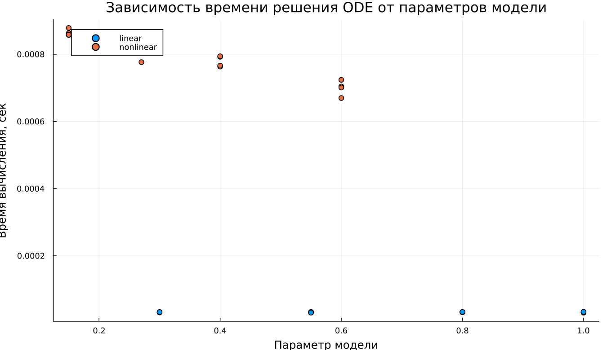

---
## Author
author:
  name: Джафар Идрисов
  email: 1132232876@rudn.ru
  affiliation:
    - name: Российский университет дружбы народов
      country: Российская Федерация
      postal-code: 117198
      city: Москва
      address: ул. Миклухо-Маклая, д. 6

## Title
title: "Математическое моделирование"
subtitle: "Лабораторная работа № 3"
license: "CC BY"
date: today
date-format: "YYYY-MM-DD"
---

# Вводная часть

## Цель работы

Исследовать модели Ланчестера, описывающие боевые действия, и проанализировать изменение численности войск при различных типах военного противостояния.

## Задание

1. Рассмотреть три варианта моделей Ланчестера.
2. Построить графики эволюции численности войск.
3. Проанализировать динамику решений и установить победившую сторону.

# Теория: модели боевых действий

## Общая идея моделей Ланчестера

В модели рассматриваются две противоборствующие стороны, численности которых задаются функциями

$$
x(t), \quad y(t)
$$

Если в некоторый момент времени одна из численностей становится равной нулю, соответствующая сторона считается потерпевшей поражение.

## Случай 1: регулярные войска против регулярных войск

Математическая модель записывается в виде

$$
\begin{cases}
\frac{dx}{dt}= -a(t)x(t) - b(t)y(t) + P(t) \\
\frac{dy}{dt}= -c(t)x(t) - h(t)y(t) + Q(t)
\end{cases}
$$

В данной системе учитываются:

- потери, не связанные непосредственно с боем;
- боевые потери;
- пополнение армии за счёт подкрепления.

## Случай 2: регулярные войска против партизан

Если одной из сторон выступают партизанские формирования, модель принимает вид

$$
\begin{cases}
\frac{dx}{dt}= -a(t)x(t) - b(t)y(t) + P(t) \\
\frac{dy}{dt}= -c(t)x(t)y(t) - h(t)y(t) + Q(t)
\end{cases}
$$

В этом случае потери партизан определяются как численностью регулярной армии, так и собственной численностью партизанских сил.

## Случай 3: партизаны против партизан

Для конфликта между двумя нерегулярными формированиями система имеет вид

$$
\begin{cases}
\frac{dx}{dt}= -a(t)x(t) - b(t)x(t)y(t) + P(t) \\
\frac{dy}{dt}= -h(t)y(t) - c(t)x(t)y(t) + Q(t)
\end{cases}
$$

# Упрощённые модели

## Жесткая модель для регулярных армий

Если пренебречь подкреплением и небоевыми потерями, система упрощается до вида

$$
\begin{cases}
\frac{dx}{dt}= -by \\
\frac{dy}{dt}= -ax
\end{cases}
$$

Для такой модели можно получить аналитическое решение, а фазовые траектории оказываются гиперболическими.

## Качественный вывод

Исход противостояния определяется не только стартовой численностью армий, но и уровнем их боевой эффективности.

Из рассмотрения модели следует:

- численное превосходство даёт заметное преимущество;
- компенсация этого преимущества возможна только при существенном росте эффективности вооружения и ведения боя.

# Постановка задачи

## Исходные данные

Рассматривается вооружённый конфликт между странами $X$ и $Y$.

Начальные значения численностей войск:

$$
x(0)=32888, \qquad y(0)=17777
$$

Необходимо построить графики изменения численности армий для двух рассматриваемых случаев.

## Случай 1: линейная модель

$$
\begin{cases}
\frac{dx}{dt}= -0.55x(t) - 0.77y(t) + 1.5\sin(3t+1) \\
\frac{dy}{dt}= -0.66x(t) - 0.44y(t) + 1.2\cos(t+1)
\end{cases}
$$

## Случай 2: нелинейная модель

$$
\begin{cases}
\frac{dx}{dt}= -0.27x(t) - 0.88y(t) + \sin(20t) \\
\frac{dy}{dt}= -0.68x(t)y(t) - 0.37y(t) + \cos(10t)
\end{cases}
$$

# Эксперимент: базовые расчёты

## Базовый эксперимент: линейная модель

## Базовый эксперимент: линейная модель

Основные наблюдения:

- обе функции снижаются с течением времени;
- переменная $x(t)$ убывает постепенно и без резких скачков;
- переменная $y(t)$ уменьшается быстрее и к завершению интервала становится близкой к нулю;
- поведение системы можно считать устойчивым и предсказуемым.

## Базовый эксперимент: нелинейная модель

## Базовый эксперимент: нелинейная модель

Результаты показывают, что:

- функция $x(t)$ убывает медленнее, чем в линейной постановке;
- функция $y(t)$ почти сразу стремится к нулю;
- после этого основную роль в динамике системы играет переменная $x(t)$;
- нелинейные слагаемые заметно ускоряют подавление одной из компонент.

# Параметрический анализ

## Сканирование траекторий $x(t)$

## Сканирование траекторий $x(t)$

При исследовании изменялся один из параметров модели.

Полученные результаты позволяют сделать выводы:

- с ростом параметра скорость уменьшения $x(t)$ возрастает;
- кривые становятся более крутыми;
- различия между траекториями особенно хорошо видны во второй половине интервала интегрирования.

## Сканирование траекторий $y(t)$

## Сканирование траекторий $y(t)$

По графикам можно отметить следующее:

- в линейной модели увеличение параметра ускоряет спад функции $y(t)$;
- в нелинейной модели $y(t)$ практически сразу становится близкой к нулю почти для всех значений параметра;
- доминирующее влияние оказывают нелинейные члены системы.

# Анализ вычислительных затрат

## Время вычислений

## Время вычислений

Результаты численного эксперимента показывают:

- линейная модель требует меньше времени на вычисление;
- время решения линейной системы имеет порядок $10^{-5}$ сек;
- для нелинейной модели характерно время порядка $10^{-4}$–$10^{-3}$ сек;
- даже при этом вычислительная стоимость остаётся малой.

# Анализ итоговой метрики

## Метрика norm_final

В качестве итогового показателя использовалась величина

$$
\text{norm\_final}=\sqrt{x(t_{final})^2 + y(t_{final})^2}
$$

Она характеризует итоговую норму вектора состояния системы в конце расчётного интервала.

## Зависимость norm_final от параметра

## Интерпретация результата

По результатам анализа можно сделать следующие выводы:

- при увеличении параметра величина метрики уменьшается;
- линейная система быстрее приближается к состоянию покоя;
- нелинейная модель дольше сохраняет ненулевое состояние;
- это связано прежде всего с более медленным уменьшением функции $x(t)$.

# Итоги

## Выводы

1. Линейная модель характеризуется плавным и прогнозируемым уменьшением обеих переменных.
2. В нелинейной постановке переменная $y(t)$ очень быстро стремится к нулю.
3. Параметры модели заметно влияют на скорость затухания решений.
4. В линейной системе это влияние проявляется более отчётливо.
5. Нелинейная модель требует больших вычислительных затрат, однако они всё равно остаются незначительными.
6. Метрика $\text{norm\_final}$ уменьшается при увеличении параметра, что указывает на усиление затухания динамики.

# Список литературы

1. Законы Осипова — Ланчестера.
2. Дифференциальные уравнения динамики боя.
3. Элементарные модели боя.
