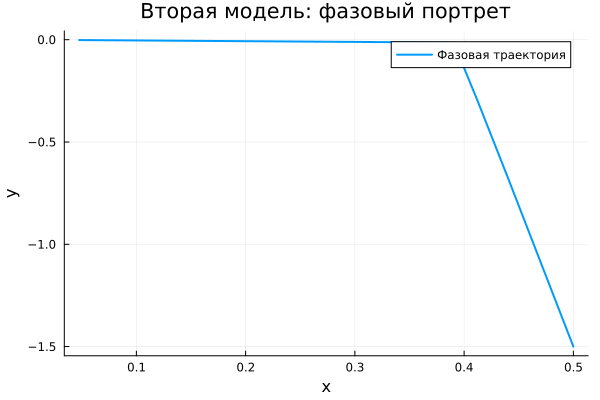

---
## Author
author:
  name: Джафар Идрисов
  email: 1132232876@rudn.ru
  affiliation:
    - name: Российский университет дружбы народов
      country: Российская Федерация
      postal-code: 117198
      city: Москва
      address: ул. Миклухо-Маклая, д. 6

## Title
title: "Математическое моделирование"
subtitle: "Лабораторная работа № 4"
license: "CC BY"
---

# Цель работы

Исследовать динамику гармонического осциллятора и проанализировать различные режимы его поведения.

# Задание

1. Построить решение уравнения гармонического осциллятора без учета затухания.
2. Записать и исследовать уравнение свободных затухающих колебаний, а также построить фазовый портрет.
3. Рассмотреть случай вынужденных колебаний при наличии внешнего воздействия и построить соответствующий фазовый портрет.

# Выполнение лабораторной работы

## Теоретические сведения

Множество физических процессов — движение механических систем, электрические колебания и динамика биологических моделей — можно описать единым математическим аппаратом. В основе лежит дифференциальное уравнение второго порядка, формирующее модель линейного гармонического осциллятора.

Общее уравнение имеет вид:
$$
\ddot{x} + 2\gamma \dot{x} + \omega_0^2 x = 0
$$

где $x$ характеризует состояние системы, $\gamma$ определяет интенсивность потерь энергии, а $\omega_0$ задаёт собственную частоту.

При отсутствии диссипации ($\gamma = 0$) система становится консервативной:
$$
\ddot{x} + \omega_0^2 x = 0
$$

Для корректного решения необходимо задать начальные условия:
$$
\begin{cases}
x(t_0) = x_0 \\
\dot{x}(t_0) = y_0
\end{cases}
$$

Переход к системе первого порядка осуществляется следующим образом:
$$
\begin{cases}
\dot{x} = y \\
\dot{y} = -\omega_0^2 x
\end{cases}
$$

С начальными условиями:
$$
\begin{cases}
x(t_0) = x_0 \\
y(t_0) = y_0
\end{cases}
$$

Пара переменных $x, y$ формирует фазовое пространство. Каждому решению соответствует траектория на фазовой плоскости, а совокупность таких траекторий образует фазовый портрет системы.

## Задача

Требуется построить решения и фазовые портреты для следующих моделей:

1. Без затухания:
$$
\ddot{x} + 5.2x = 0
$$

2. С затуханием:
$$
\ddot{x} + 14\dot{x} + 0.5x = 0
$$

3. С затуханием и внешней силой:
$$
\ddot{x} + 13\dot{x} + 0.3x = 0.8\sin(9t)
$$

Интервал моделирования:
$t \in [0; 59]$, шаг $0.05$, начальные условия $x_0 = 0.5$, $y_0 = -1.5$.

### Преобразования моделей

1. Без затухания:
$$
\begin{cases}
\dot{x} = y \\
\dot{y} = -\omega_0^2 x
\end{cases}
$$

2. С затуханием:
$$
\begin{cases}
\dot{x} = y \\
\dot{y} = -2\gamma y - \omega_0^2 x
\end{cases}
$$

3. С внешним воздействием:
$$
\begin{cases}
\dot{x} = y \\
\dot{y} = F(t) - 2\gamma y - \omega_0^2 x
\end{cases}
$$

Для численного моделирования использовались внешние программные модули:





## Базовые эксперименты

### Первая модель (model_type = model1)

В данной модели наблюдаются устойчивые периодические колебания. Амплитуда сохраняется неизменной, что указывает на отсутствие потерь энергии. График демонстрирует регулярную структуру, характерную для идеальной колебательной системы.

Фазовая траектория представляет собой замкнутую кривую, что подтверждает периодичность движения и сохранение энергии.

Таким образом, система реализует режим чистых гармонических колебаний без затухания.

### Вторая модель (model_type = model2)

Здесь наблюдается быстрое снижение амплитуды. Колебания практически исчезают уже на начальном этапе, и система стремится к равновесию.

Причиной служит наличие демпфирования, приводящего к рассеянию энергии.

Фазовый портрет демонстрирует стягивание траекторий к точке покоя.

Следовательно, система переходит в устойчивое состояние без колебаний.

### Третья модель (model_type = model3)

В этой модели сочетаются затухание и внешнее воздействие. После переходного процесса система выходит на устойчивый режим вынужденных колебаний.

Амплитуда меньше, чем в первой модели, однако не исчезает благодаря постоянному воздействию внешней силы.

Фазовый портрет формирует компактную замкнутую область около равновесия.

Таким образом, система демонстрирует установившиеся вынужденные колебания.

## Параметрическое сканирование

### Траектории $x(t)$ для различных параметров

Проведено исследование влияния параметров на поведение моделей.

В первой модели изменение параметра отражается на частоте колебаний.

Во второй — влияет на интенсивность затухания.

В третьей — определяет характеристики вынужденного режима.

Основные выводы:

- первая система сохраняет колебательный характер;
- вторая система быстро стабилизируется;
- третья выходит на устойчивый режим.

### Траектории $y(t)$ для различных параметров

Анализ переменной $y(t)$ подтверждает ранее полученные результаты.

Первая модель остаётся колебательной, вторая — затухает, третья — поддерживается внешней силой.

## Время вычислений

Результаты измерений показывают:

- минимальное время у первой модели;
- умеренное у второй;
- наибольшее у третьей.

Несмотря на различия, вычисления выполняются быстро.

## Анализ метрики norm_final

Рассматриваемая метрика:
$$
\text{norm\_final} = \sqrt{x(t_{final})^2 + y(t_{final})^2}
$$

Анализ показывает:

- в первой модели значение остаётся значительным;
- во второй стремится к нулю;
- в третьей стабилизируется на малом уровне.

# Выводы

1. Первая модель описывает незатухающие колебания.
2. Вторая демонстрирует быстрое затухание.
3. Третья отражает вынужденный режим.
4. Параметры существенно влияют на динамику системы.
5. Численные методы обеспечивают эффективное решение.
6. Метрика $\text{norm\_final}$ подтверждает различие режимов.

# Список литературы {.unnumbered}

1. [Гармонический осциллятор](https://ru.wikipedia.org/wiki/Гармонический_осциллятор)
2. [Модели колебательных систем](https://www.numamo.org/HTML/Articles/Oscillator.html)
