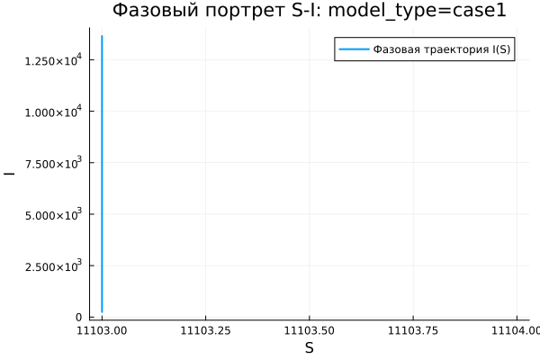

---
author:
  name: Джафар Идрисов
  email: 1132232876@rudn.ru
  affiliation:
    - name: Российский университет дружбы народов
      country: Российская Федерация
      city: Москва
title: "Математическое моделирование"
subtitle: "Лабораторная работа № 6"
license: "CC BY"
date: today
date-format: "YYYY-MM-DD"
---

# Вводная часть

## Цель работы

Исследовать эпидемиологическую модель $SIR$ и рассмотреть динамику распространения заболевания в зависимости от начального числа инфицированных.

## Задание

1. Изучить математическую модель эпидемии.
2. Построить графики изменения групп $S(t)$, $I(t)$ и $R(t)$.
3. Проанализировать два режима:
   - $I(0) \leq I^*$;
   - $I(0) > I^*$.
4. Провести параметрическое исследование.
5. Сравнить результаты моделирования.

# Теоретические сведения

## Модель $SIR$

В модели $SIR$ вся популяция делится на три группы:

- $S(t)$ — восприимчивые к заболеванию;
- $I(t)$ — инфицированные и распространяющие болезнь;
- $R(t)$ — выздоровевшие, получившие иммунитет.

Общая численность популяции задается выражением:

$$
N = S(t) + I(t) + R(t).
$$

## Основная идея модели

Модель описывает последовательный переход особей между группами:

$$
S \rightarrow I \rightarrow R.
$$

Сначала здоровые восприимчивые особи заражаются и переходят в группу $I$. Затем инфицированные выздоравливают и переходят в группу $R$.

## Условие изоляции

До достижения критического значения $I^*$ будем считать, что инфицированные изолированы и не заражают восприимчивых.

Если выполняется условие

$$
I(t) \leq I^*,
$$

то новые заражения отсутствуют.

Если же

$$
I(t) > I^*,
$$

то инфекция начинает распространяться среди восприимчивых особей.

## Уравнение для $S(t)$

Изменение числа восприимчивых описывается уравнением:

$$
\frac{dS}{dt} =
\begin{cases}
-\alpha S, & I(t) > I^*, \\
0, & I(t) \leq I^*.
\end{cases}
$$

При превышении критического уровня число восприимчивых уменьшается, так как часть из них заражается.

## Уравнение для $I(t)$

Динамика инфицированных задается выражением:

$$
\frac{dI}{dt} =
\begin{cases}
\alpha S - \beta I, & I(t) > I^*, \\
-\beta I, & I(t) \leq I^*.
\end{cases}
$$

Первое слагаемое отвечает за появление новых заболевших, второе — за выбывание инфицированных вследствие выздоровления.

## Уравнение для $R(t)$

Число выздоровевших изменяется по закону:

$$
\frac{dR}{dt} = \beta I.
$$

Параметры модели имеют следующий смысл:

- $\alpha$ — коэффициент заражения;
- $\beta$ — коэффициент выздоровления.

# Постановка задачи

## Исходные данные

На острове началась эпидемия.

Известны следующие данные:

$$
N = 11400,
$$

$$
I(0) = 250,
$$

$$
R(0) = 47.
$$

## Начальное значение $S(0)$

Количество восприимчивых к заболеванию людей в начальный момент времени определяется как:

$$
S(0) = N - I(0) - R(0).
$$

После подстановки исходных данных получаем:

$$
S(0) = 11400 - 250 - 47 = 11103.
$$

## Рассматриваемые режимы

В работе анализируются два случая:

1. $I(0) \leq I^*$ — начальное число инфицированных не превышает критический уровень.
2. $I(0) > I^*$ — начальное число инфицированных больше критического уровня.

# Базовые эксперименты

## Первая модель: временные зависимости

## Первая модель: фазовый портрет

## Анализ первой модели

Для первой модели наблюдается поведение, которое не соответствует классической эпидемической динамике:

- $S(t)$ остается постоянным;
- $I(t)$ быстро возрастает;
- $R(t)$ уменьшается и может принимать отрицательные значения;
- стабилизация системы не происходит.

## Вывод по первой модели

Главная особенность первой модели заключается в том, что

$$
S(t) = const.
$$

Из-за этого число восприимчивых не уменьшается, а количество инфицированных растет без естественного ограничения.

Такое поведение нарушает физический смысл модели, поскольку число выздоровевших не должно становиться отрицательным, а рост инфицированных не может быть бесконечным в конечной популяции.

# Вторая модель

## Вторая модель: временные зависимости

## Вторая модель: фазовый портрет

## Анализ второй модели

Во второй модели динамика соответствует типичной $SIR$-системе:

- $S(t)$ монотонно уменьшается;
- $I(t)$ сначала возрастает;
- затем $I(t)$ достигает максимума;
- после пика число инфицированных снижается;
- $R(t)$ монотонно увеличивается.

## Интерпретация второй модели

В начале эпидемии инфекция активно распространяется, поскольку число восприимчивых велико.

Затем количество восприимчивых уменьшается, поэтому скорость заражения падает. В результате эпидемия постепенно затухает:

$$
I(t) \rightarrow 0.
$$

Система переходит к устойчивому состоянию, где инфицированных почти не остается.

# Сравнение базовых моделей

## Качественное различие

| Характеристика | Первая модель | Вторая модель |
|---|---|---|
| $S(t)$ | не изменяется | убывает |
| $I(t)$ | растет без ограничения | имеет конечный максимум |
| $R(t)$ | может стать отрицательным | возрастает |
| Фазовая траектория | вертикальная линия | незамкнутая кривая |
| Физический смысл | нарушается | сохраняется |

# Параметрическое исследование

## Сканирование траекторий $S(t)$

## Анализ траекторий $S(t)$

Для первой модели:

- $S(t)$ остается постоянным;
- изменение параметров не меняет динамику восприимчивых;
- система не описывает процесс заражения восприимчивых особей.

Для второй модели:

- $S(t)$ постепенно уменьшается;
- скорость убывания зависит от параметра $a$;
- при большем $a$ восприимчивые быстрее переходят в группу инфицированных.

## Сканирование траекторий $I(t)$

## Анализ траекторий $I(t)$

В первой модели:

- $I(t)$ растет экспоненциально;
- увеличение параметра $b$ усиливает рост;
- максимум инфицированных не ограничивается.

Во второй модели:

- формируется эпидемическая волна;
- $I(t)$ сначала увеличивается;
- затем достигает пика и убывает;
- рост ограничивается конечным размером популяции.

## Сканирование траекторий $R(t)$

## Анализ траекторий $R(t)$

В первой модели:

- $R(t)$ убывает;
- возможен переход в отрицательную область;
- переменная теряет физический смысл.

Во второй модели:

- $R(t)$ возрастает;
- происходит накопление выздоровевших;
- функция стремится к конечному предельному значению.

## Фазовые траектории

## Анализ фазовых траекторий

Фазовые портреты показывают принципиальную разницу между моделями.

В первой модели траектории вырождаются в вертикальные линии, так как $S$ остается неизменным.

Во второй модели фазовые траектории имеют характерную форму для $SIR$-процесса:

- сначала $I$ растет при уменьшении $S$;
- затем $I$ снижается;
- система движется к состоянию без активной эпидемии.

# Анализ итоговых метрик

## Метрика $\text{norm\_final}$

Для сравнения конечных состояний использовалась метрика:

$$
\text{norm\_final} =
\sqrt{
S(t_{final})^2 +
I(t_{final})^2 +
R(t_{final})^2
}.
$$

Она показывает величину итогового состояния системы после завершения моделирования.

## Зависимость $\text{norm\_final}$ от параметра

## Интерпретация $\text{norm\_final}$

Для первой модели:

- метрика быстро увеличивается;
- основной вклад в рост дает $I(t)$;
- отрицательные значения $R(t)$ также увеличивают норму по модулю.

Для второй модели:

- значения метрики ниже;
- изменение происходит плавнее;
- система стремится к конечному стационарному состоянию.

# Максимум инфицированных

## Зависимость $I_{max}$ от параметра

## Анализ $I_{max}$

В первой модели:

- $I_{max}$ принимает очень большие значения;
- рост инфицированных не ограничивается;
- увеличение параметра $b$ резко усиливает максимум.

Во второй модели:

- $I_{max}$ остается конечным;
- пик зависит от параметра $a$;
- при увеличении $a$ максимум достигается быстрее;
- дальнейшее уменьшение $I(t)$ связано с истощением группы $S(t)$.

# Анализ вычислений

## Время вычислений

## Интерпретация времени вычислений

Результаты бенчмаркинга показывают, что обе модели решаются численно достаточно быстро.

Время вычислений имеет порядок:

$$
10^{-4}
$$

секунды.

Основные наблюдения:

- вычисления выполняются эффективно;
- изменение параметров почти не влияет на время работы;
- небольшие колебания связаны с особенностями численного интегрирования;
- даже при быстром росте решений время расчета остается малым.

# Итоги

## Основные результаты

1. Первая модель демонстрирует нефизичную динамику.
2. В первой модели число инфицированных растет без ограничения.
3. Вторая модель описывает реалистичный эпидемический процесс.
4. Во второй модели число инфицированных проходит через максимум и затем убывает.
5. При $t \to \infty$ для второй модели выполняется:

$$
I(t) \to 0.
$$

6. Фазовые портреты подтверждают качественное различие моделей.

## Выводы

1. Модель case1 не является корректной для описания реального распространения эпидемии.
2. Модель case2 соответствует классической логике $SIR$-процесса.
3. Параметры $a$ и $b$ влияют на скорость изменения групп населения.
4. Метрики $\text{norm\_final}$ и $I_{max}$ позволяют количественно сравнить модели.
5. Численное моделирование выполняется быстро и не требует больших вычислительных ресурсов.

# Список литературы {.unnumbered}

1. [Конструирование эпидемиологических моделей](https://habr.com/ru/post/551682/)
2. [Зараза, гостья наша](https://nplus1.ru/material/2019/12/26/epidemic-math)
