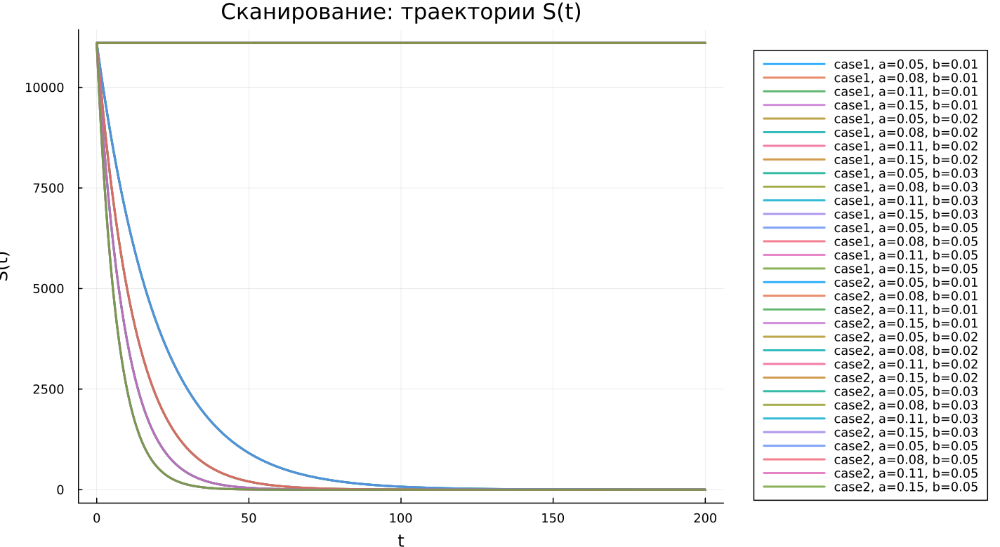

---
## Author
author:
  name: Джафар Идрисов
  email: 1132232876@rudn.ru
  affiliation:
    - name: Российский университет дружбы народов
      country: Российская Федерация
      postal-code: 117198
      city: Москва
      address: ул. Миклухо-Маклая, д. 6

## Title
title: "Математическое моделирование"
subtitle: "Лабораторная работа № 6"
license: "CC BY"
---

# Цель работы

Исследовать эпидемиологическую модель $SIR$ и проанализировать особенности изменения численности групп населения в процессе распространения заболевания.

# Задание

1. Изучить математическую модель эпидемии.
2. Построить графики изменения количества особей в каждой из трех групп. Проанализировать развитие эпидемии для двух случаев: $I(0)\leq I^*$ и $I(0)>I^*$.

# Выполнение лабораторной работы

## Теоретические сведения

Рассмотрим базовую модель распространения эпидемии. Пусть имеется изолированная популяция численностью $N$. В рамках модели все особи разделяются на три категории.

Первая категория — восприимчивые к заболеванию, но пока не инфицированные особи. Их количество обозначается через $S(t)$. Вторая категория — инфицированные особи, являющиеся переносчиками заболевания. Их численность обозначим через $I(t)$. Третья категория — особи, которые выздоровели и приобрели иммунитет к болезни. Эта группа обозначается через $R(t)$.

Предполагается, что до тех пор, пока число заболевших не превышает некоторого критического уровня $I^*$, инфицированные изолированы и не передают заболевание здоровым. Если же выполняется условие $I(t)>I^*$, то зараженные начинают распространять инфекцию среди восприимчивых особей.

Тогда изменение числа восприимчивых особей $S(t)$ описывается следующим образом:

$$
\frac{dS}{dt}=
 \begin{cases}
	-\alpha S &\text{, если $I(t) > I^*$}
	\\   
	0 &\text{, если $I(t) \leq I^*$}
 \end{cases}
$$

Поскольку каждая восприимчивая особь после заражения переходит в группу инфицированных, скорость изменения $I(t)$ определяется разностью между числом новых заболевших и числом тех, кто покидает группу инфицированных вследствие выздоровления. Поэтому:

$$
\frac{dI}{dt}=
 \begin{cases}
	\alpha S -\beta I &\text{, если $I(t) > I^*$}
	\\   
	-\beta I &\text{, если $I(t) \leq I^*$}
 \end{cases}
$$

Число выздоровевших, получивших иммунитет, изменяется по закону:

$$
\frac{dR}{dt} = \beta I
$$

Коэффициент $\alpha$ характеризует интенсивность заражения, а коэффициент $\beta$ отвечает за скорость выздоровления. Для однозначного определения решения системы необходимо задать начальные условия. В начальный момент времени $t=0$ задаются значения $S(0)$, $I(0)$ и $R(0)$.

Для анализа поведения модели необходимо рассмотреть два принципиально разных варианта:

1. $I(0) \leq I^*$
2. $I(0)>I^*$

### Задача

На острове началась эпидемия. Известно, что общее число жителей острова равно

$$
N=11400.
$$

В начальный момент времени $t=0$ число заболевших, которые являются распространителями инфекции, составляет

$$
I(0)=250.
$$

Также известно, что число здоровых людей, уже имеющих иммунитет к заболеванию, равно

$$
R(0)=47.
$$

Следовательно, начальное число восприимчивых к заболеванию, но пока здоровых людей определяется выражением:

$$
S(0)=N-I(0)-R(0).
$$

Необходимо построить графики изменения численности всех трех групп населения: $S(t)$, $I(t)$ и $R(t)$.

Также требуется рассмотреть развитие эпидемии в случаях:

1. $I(0)\leq I^*$
2. $I(0)>I^*$

Для моделирования процесса и построения графиков использовались внешние файлы с программным кодом:





## Базовые эксперименты

### Первая модель (model_type = case1)

В первой модели система показывает поведение, отличающееся от стандартной эпидемиологической динамики. Количество восприимчивых особей $S(t)$ не изменяется со временем. Это напрямую следует из уравнения

$$
\frac{dS}{dt}=0.
$$

При этом число инфицированных $I(t)$ возрастает по экспоненциальному закону. Одновременно значение $R(t)$ уменьшается и в дальнейшем становится отрицательным.

Такой результат нельзя считать физически корректным для классической модели эпидемии. В системе отсутствует механизм, который ограничивал бы рост числа инфицированных. Кроме того, переменная $R(t)$ теряет содержательный смысл, так как количество выздоровевших или выбывших особей не может быть отрицательным.

Фазовый портрет подтверждает эту особенность. Траектория фактически превращается в вертикальную линию, поскольку значение $S$ остается неизменным, а вся динамика связана только с изменением $I$. Следовательно, вместо полноценной двумерной динамической системы фактически получается одномерный процесс.

Таким образом, первая модель описывает неограниченный рост числа инфицированных без выхода к устойчивому состоянию. Поэтому ее нельзя считать адекватной моделью распространения заболевания.

### Вторая модель (model_type = case2)

Во второй модели наблюдается поведение, характерное для классической $SIR$-системы. Количество восприимчивых особей $S(t)$ постепенно уменьшается, что отражает процесс заражения. Число инфицированных $I(t)$ сначала увеличивается, затем достигает максимального значения, после чего начинает снижаться и стремится к нулю. Число выбывших или выздоровевших особей $R(t)$, наоборот, монотонно возрастает.

Такая динамика соответствует естественному развитию эпидемического процесса в популяции конечного размера. На начальном этапе заболевание активно распространяется. Затем, по мере уменьшения числа восприимчивых людей, интенсивность заражения снижается, и эпидемия постепенно затухает.

Фазовый портрет имеет вид незамкнутой кривой. Сначала траектория идет вверх, что соответствует росту $I$ при уменьшении $S$. Затем кривая начинает снижаться, отражая уменьшение числа инфицированных. Это показывает, что система проходит через пик эпидемии и затем переходит к стадии затухания.

В отличие от первой модели, вторая модель демонстрирует переход к стационарному состоянию:

$$
I(t) \to 0.
$$

При этом $S(t)$ стремится к некоторому остаточному уровню, а $R(t)$ достигает конечного значения.

## Параметрическое сканирование

### Траектории $S(t)$ для различных параметров

Анализ графиков $S(t)$ показывает, что модели по-разному реагируют на изменение параметров.

В первой модели (case1) значение $S(t)$ остается постоянным для всех рассматриваемых параметров. Это связано с тем, что в данной системе выполняется условие

$$
\frac{dS}{dt}=0.
$$

Следовательно, изменение коэффициентов не оказывает влияния на численность восприимчивых особей.

Во второй модели (case2) наблюдается убывание $S(t)$. Скорость этого уменьшения зависит от параметра $a$. При увеличении $a$ восприимчивые особи быстрее переходят в группу инфицированных, поэтому график $S(t)$ спадает более интенсивно.

Основные результаты наблюдения:

- в первой модели $S(t)$ остается неизменным;
- во второй модели $S(t)$ уменьшается со временем;
- параметр $a$ определяет скорость сокращения числа восприимчивых особей.

### Траектории $I(t)$ для различных параметров

Для первой модели во всех рассмотренных случаях наблюдается экспоненциальный рост числа инфицированных $I(t)$. При увеличении параметра $b$ скорость роста становится значительно выше, что приводит к очень большим значениям $I(t)$.

Во второй модели поведение $I(t)$ имеет иной характер. Сначала число инфицированных увеличивается, затем достигает пикового значения, после чего начинает убывать. Параметр $a$ влияет как на высоту пика, так и на момент его достижения. При больших значениях $a$ максимум достигается быстрее, но спад также наступает раньше.

Можно выделить следующие особенности:

- первая модель приводит к неограниченному росту инфицированных;
- вторая модель формирует типичную эпидемическую волну;
- параметры системы определяют скорость и масштаб распространения заболевания.

### Траектории $R(t)$ для различных параметров

В первой модели значение $R(t)$ уменьшается и со временем становится отрицательным. При этом модуль отрицательных значений быстро возрастает. Такое поведение указывает на некорректность данной модели, поскольку переменная $R(t)$ должна описывать количество выздоровевших или выбывших особей, а значит не может принимать отрицательные значения.

Во второй модели $R(t)$ ведет себя физически осмысленно: функция монотонно возрастает и постепенно приближается к предельному значению. Чем интенсивнее процесс заражения, тем быстрее происходит накопление выбывших из группы инфицированных.

Следовательно:

- первая модель дает нефизичные значения $R(t)$;
- вторая модель корректно описывает накопление выздоровевших;
- параметры влияют на скорость выхода $R(t)$ к насыщению.

### Фазовые траектории для различных параметров

Фазовые портреты позволяют наглядно сравнить качественное поведение двух моделей.

В первой модели все траектории фактически сводятся к вертикальным линиям. Это объясняется тем, что переменная $S$ не изменяется, а динамика происходит только за счет изменения $I$. Поэтому полноценной фазовой зависимости между $S$ и $I$ не возникает.

Во второй модели фазовые траектории имеют характерный для эпидемического процесса вид. Сначала наблюдается рост $I$ при одновременном уменьшении $S$, затем число инфицированных начинает снижаться, хотя $S$ продолжает уменьшаться.

Таким образом, изменение параметров не меняет принципиальную структуру поведения моделей:

- первая модель остается вырожденной;
- вторая модель сохраняет реалистичную эпидемическую динамику.

### Анализ метрики norm_final

Для количественного сравнения результатов рассматривалась метрика

$$
\text{norm\_final} = \sqrt{S(t_{final})^2 + I(t_{final})^2 + R(t_{final})^2}.
$$

В первой модели значение $\text{norm\_final}$ быстро увеличивается при росте параметра $b$. Это объясняется экспоненциальным увеличением $I(t)$ и одновременным уходом $R(t)$ в отрицательную область. В результате итоговая норма становится очень большой.

Во второй модели значения данной метрики существенно ниже и изменяются более плавно. Это связано с тем, что система стремится к стационарному состоянию, при котором число инфицированных исчезает:

$$
I(t) \to 0.
$$

А значения $S(t)$ и $R(t)$ остаются конечными.

Основные выводы по метрике:

- в первой модели $\text{norm\_final}$ растет без ограничения;
- во второй модели метрика характеризует конечное устойчивое состояние системы.

### Анализ максимального числа инфицированных

Максимальное число инфицированных $I_{max}$ существенно зависит от выбранных параметров.

В первой модели $I_{max}$ достигает очень больших значений. Это связано с тем, что в системе отсутствует механизм, ограничивающий рост числа заболевших. При увеличении параметра $b$ максимальное значение $I(t)$ резко возрастает.

Во второй модели максимум числа инфицированных остается конечным. Значение $I_{max}$ зависит от параметра $a$: при его увеличении пик эпидемии достигается быстрее, однако численность инфицированных остается ограниченной.

Следовательно:

- первая модель демонстрирует неограниченный рост $I_{max}$;
- вторая модель описывает контролируемую эпидемическую волну с конечным максимумом.

### Время вычислений

Анализ времени вычислений показывает, что численное решение во всех экспериментах выполняется достаточно быстро. Время работы остается одного порядка и составляет примерно

$$
\sim 10^{-4}
$$

секунды.

Для обеих моделей изменение параметров практически не влияет на вычислительные затраты. Небольшие колебания времени связаны с особенностями используемого численного метода и адаптивным выбором шага интегрирования.

Можно сделать следующие выводы:

- обе модели эффективно решаются численными методами;
- изменение параметров почти не влияет на вычислительную сложность;
- даже при быстром росте решений в первой модели время вычисления остается малым.

## Выводы

1. Первая модель (case1) показывает неограниченный экспоненциальный рост числа инфицированных при неизменном числе восприимчивых. Это указывает на ее нефизичность и отсутствие механизма стабилизации.
2. Вторая модель (case2) воспроизводит типичную эпидемическую динамику: сначала число инфицированных растет, затем достигает максимума и постепенно уменьшается.
3. Фазовые портреты подтверждают различие моделей. В первой модели траектории вырождаются в вертикальные линии, а во второй формируются полноценные кривые, отражающие развитие эпидемии.
4. Параметры $a$ и $b$ заметно влияют на динамику системы. Параметр $a$ определяет скорость уменьшения числа восприимчивых, а параметр $b$ влияет на интенсивность изменения числа инфицированных.
5. Метрика $\text{norm\_final}$ позволяет количественно сравнить модели. В первой модели она быстро возрастает, а во второй остается связанной с конечным состоянием системы.
6. Максимальное число инфицированных $I_{max}$ в первой модели растет без ограничения, тогда как во второй модели оно остается конечным и зависит от параметров.
7. Численное решение обеих моделей выполняется быстро, а изменение параметров практически не увеличивает вычислительную сложность.

# Список литературы {.unnumbered}

1. [Конструирование эпидемиологических моделей](https://habr.com/ru/post/551682/)
2. [Зараза, гостья наша](https://nplus1.ru/material/2019/12/26/epidemic-math)
